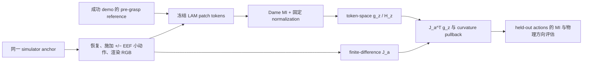

# Pipeline v5：从视觉 MI 到 LIBERO 动作向量场的代码迁移计划

## 1. 目的与结论

Pipeline v3/v4 已经验证：直接把视觉 MI potential、action latent 或其差分当作
trajectory reward，不能稳定地区分跨初始状态的物理进展。因此不能继续修改
`Directional-MI Teacher -> P/U/N -> Qwen3-VL reward` 主线来解决这个问题。

v5 的可检验假设更窄：在一个没有接触、抓取或成功离散事件的局部 LIBERO 阶段，
冻结视觉 token 的 Dame MI 标量场是否能经由视觉/动力学 Jacobian 拉回到 3D EEF
平移动作空间，并预测小动作后的 MI 改变量和 EEF 到操作物体的距离改变量。

这意味着代码应新增一个**局部几何验证层**，而不是重写 reward pipeline。它只产出
导数、候选动作和物理对照指标；不产出 P/U/N 标签，不训练 Qwen，也不启动 RL。

当前仓库已经具备三个必要基础：

| 已有组件 | 实际接口 | v5 中的用途 |
| --- | --- | --- |
| Dame MI | `mi_reward/scoring/dame_soft_histogram.py::DameSoftHistogramMI` | 对对应 patch token 计算可微 MI 和 token-space gradient/Hessian |
| 冻结视觉 patch token | `mi_reward/features/lawam_lam_extractor.py::LaWAMLAMFeatureExtractor.extract_image_tokens` | 从每个 agentview/wrist RGB 取 `[K,D]` token；不能预先平均为 `[D]` |
| LIBERO 演示、状态及物理量 | `mi_reward/data/libero_privileged.py`、`mi_reward/closed_loop/libero_env.py` | 读取成功参考、恢复状态、渲染双视角，并记录 EEF/物体距离 |

`eval/libero/probe_v5_mi_action_geometry.py` 已完成 Test 0。其结果位于
`logs/mi_reward/v5_mi_action_geometry/math_identity_v1/results.json`：gradient
pullback 误差为 `0`，Hessian pullback 最大绝对误差为 `1.041e-17`，中心差分相对
误差分别为 `1.557e-07` 和 `1.791e-06`。这只冻结数学和 autograd 实现正确性，
**不构成 LIBERO 控制或 reward 有效性的证据**。

## 2. 冻结边界

以下文件和结果保持历史记录，不作为 v5 的依赖或修改目标：

- `mi_reward/training/train_information_teacher_v3.py`、
  `mi_reward/scoring/information_teacher_v3.py` 与 v3 的 P/U/N 导出；
- `mi_reward/training/train_qwen3_vl_reward.py`、Qwen checkpoint 与 Robometer/LIBERO
  reward evaluator；
- `eval/libero/probe_v4_gate1_smoke.py`、`eval/libero/eval_v4_gate1_multistate.py`、
  `eval/libero/probe_v4_transition_evidence.py` 和全部 `logs/mi_reward/v4_*` 结果；
- `mi_reward/planning/action_proposer.py`。它的输入是已有的 `[T,A]` planner action
  candidates，不表达 v5 的局部导数或 trust-region proposal，不能作为 v5 核心；
- Cosmos/worldsample 数据和脚本。

v5 只在新增的 `mi_reward/control/`、`eval/libero/` v5 文件和
`logs/mi_reward/v5_mi_action_geometry/` 下工作。旧的 `mi_potential.py` 与
`mi_potential_field.py` 可以作为 Dame 调用方式的参考，但 v5 不导入其
directional-reward 聚合逻辑。

## 3. 目标数据流与接口



v5 的运行时动作变量固定为 `u in R^3`：环境 7 维 action 的 `[:3]`。
`action[3:6]` 固定为零，`action[6]` 固定为 anchor 的开合状态，且每个候选都执行相同
的 3--5 个 simulator steps。这里的 `u` 首先是**环境 controller command 坐标**，
不是未经验证就宣称的 world-frame 米制位移。采集器必须同时记录实际
`eef_pos_after - eef_pos_before`；只有确认其局部映射稳定后，报告中才能使用
“EEF translation”描述该坐标。

## 4. 需要新增或修改的文件

### 4.1 新增 `mi_reward/control/mi_action_field.py`

该文件是 v5 的唯一算法实现，不调用 Qwen 或旧 reward。建议以纯张量函数和小型
dataclass 组织，便于离线数据与 simulator 采集分离。

应提供以下明确接口：

```python
@dataclass(frozen=True)
class FixedNormalization:
    shift: torch.Tensor          # [D]
    scale: torch.Tensor          # [D]
    bin_range: tuple[float, float]
    fit_anchor_ids: tuple[str, ...]

@dataclass(frozen=True)
class LocalActionField:
    mi_at_anchor: float
    gradient_z: torch.Tensor     # [K*D]
    hessian_z: torch.Tensor      # [K*D,K*D]，仅小 token 子集时允许实体化
    jacobian_a: torch.Tensor     # [K*D,3]
    gradient_a: torch.Tensor     # [3]
    hessian_pullback_a: torch.Tensor  # [3,3]
    hessian_direct_a: torch.Tensor    # [3,3]
```

- `fit_fixed_normalization(reference_tokens, anchor_neighborhood_tokens)`：只在 reference
  和预先登记的 anchor neighborhood 上拟合一次，返回可 JSON/NPZ 序列化的
  `shift/scale`。候选动作和 held-out action 不得更新它。
- `mi_and_gradient(tokens, reference_tokens, normalization)`：先按已冻结的统计量归一化、
  clamp，再用 `DameSoftHistogramMI(normalization="none", channel_mode="channelwise")`
  得到 `M`、`g_z`。这样避免 `DameSoftHistogramMI(normalization="fixed")` 的首次调用
  隐式拟合 running statistics，且能显式报告每个输入的 clamp saturation ratio。
- `estimate_jacobian(plus_tokens, minus_tokens, epsilons)`：用中心差分计算
  `J_a[:,i]=(z(+eps_i e_i)-z(-eps_i e_i))/(2 eps_i)`，两套 epsilon 都保存，作为
  导数稳定性诊断，不挑选“看起来最好”的一套。
- `pullback_gradient(J_a, g_z)` 与 `pullback_hessian(J_a, H_z)`：实现
  `g_a=J_a^T g_z` 和线性近似 `J_a^T H_z J_a`。对于真实 simulator，主比较仍是
  action-space finite difference，不能把这一近似当作等式。
- `finite_difference_action_gradient_hessian(mi_values, epsilon)`：从同一 anchor 的 MI
  action probes 建立直接 3D gradient/Hessian，输出对称化前后的误差。
- `damped_trust_region_step(gradient_a, hessian_a, damping, radius)`：同时返回归一化
  gradient step 与 damped Newton step，以及线性/二次模型预测增益。Hessian 不正定、
  病态或预测增益非正时，返回明确的 fallback reason，不能静默求逆。

Hessian-vector product 可作为默认实现，避免对完整 `[K*D,K*D]` Hessian 实体化。
只有在固定、预先记录的 token 子集上才构建完整 Hessian 作 Test 1 的数值比较；保存
token-index 规则，不能按结果挑 token。

### 4.2 新增 `eval/libero/collect_v5_local_perturbations.py`

该采集器负责真正缺失的桥梁：从**完全相同**的 MuJoCo anchor 恢复环境，执行局部
动作，保存视觉 token 与物理测量。复用：

- `resolve_libero_task` 查找 official demo、BDDL 和 task language；
- `OffScreenRenderEnv`、`canonical_camera_image` 的 RGB 方向约定；
- `extract_privileged_records` 中使用的 `core._eef_xpos`、操作物体位置和 grasp/success
  查询方式。

不要复用 `collect_rollouts.py` 的整段 demo/open-gripper rollout 逻辑：它保存的是轨迹
控制对照，不能保证每个 action probe 回到同一中间 anchor。

采集流程：

1. 从独立成功 demo 选择 pre-grasp、未接触、未成功的 reference frame；reference demo
   不得与 anchor demo 相同。保存 demo、frame、状态 SHA256 和筛选理由。
2. 对至少 5 个初始状态收集不少于 20 个 pre-contact anchors；每个 anchor 保存其完整
   simulator state、EEF/object positions、gripper 状态、reference id 与渲染 RGB。
3. 对每个 probe 从该 anchor 重建环境、设置同一 state、执行 `+/- eps_i e_i`、二阶
   cross probes 和 24 个 held-out 小动作。每次都保存 action command、步数、实际 EEF
   delta、agentview/wrist RGB、后继 state 与 MI 输入 token。
4. 排除并记录任何 grasp state 改变、object-goal contact、success、episode done、或
   大于预登记阈值的 object displacement。被排除样本不计入指标分母。
5. 在第一次恢复与每次候选恢复后，比较 anchor RGB hash、EEF position 和 object
   positions；不满足容差即标记 `restore_failed` 并使该 anchor 无效。

建议输出为目录 `logs/mi_reward/v5_mi_action_geometry/<run>/anchors/`：每个 anchor 一份
`.npz`（states、actions、EEF/object vectors、tokens）和一个 JSON manifest。RGB 使用
`frames/<anchor_id>/<candidate_id>/{agentview,wrist}.png`。不要把原始大图或 simulator
state 塞入 JSON。

最小 manifest schema：

```json
{
  "schema_version": "v5_local_geometry_anchor_v1",
  "suite": "libero_spatial",
  "task_id": 0,
  "language": "...",
  "anchor_id": "...",
  "initial_state_id": 0,
  "initial_state_sha256": "...",
  "anchor_state_sha256": "...",
  "reference": {"demo": "demo_1", "frame_index": 37, "state_sha256": "..."},
  "stage": {"pre_contact": true, "grasped": false, "success": false},
  "action_protocol": {"dims": [0, 1, 2], "orientation": [0, 0, 0], "steps": 4},
  "candidates_npz": "anchors/<anchor_id>.npz",
  "exclusions": []
}
```

### 4.3 新增 `eval/libero/eval_v5_local_geometry.py`

该 evaluator 读取完成的 manifest；它不创建环境、不训练网络。它使用固定的 LAM
checkpoint/config，提取或读取 `[K,D]` tokens，并调用 `mi_action_field.py`。

每一个 anchor 输出：

- 两套 epsilon 的 `J_a`，其相对差异和 token ordering/hash；
- MI token gradient、`J_a^T g_z`、直接 action-space finite-difference gradient；
- pullback Hessian、直接 3D Hessian、对称性/条件数/damping/fallback；
- 对 24 个 held-out actions 的预测 `g_a^T u`、二次预测和实测 `Delta MI`；
- `Delta EEF-object distance`、方向一致性和全部 clamp saturation；
- 排除项与未纳入分母的原因。

汇总 JSON 必须把“导数正确性”和“物理含义”分开：

```json
{
  "benchmark": "libero_spatial",
  "protocol": "v5_local_geometry_v1",
  "feature_extractor": {"name": "LaWAMLAMFeatureExtractor", "checkpoint_sha256": "..."},
  "mi": {"name": "DameSoftHistogramMI", "num_bins": 8, "normalization": "frozen_external"},
  "coverage": {"initial_states": 5, "anchors_total": 20, "anchors_valid": 0, "excluded_by_reason": {}},
  "derivative": {"jacobian_epsilon_agreement": null, "gradient_cosine": null, "hessian_relative_error": null},
  "heldout_mi": {"r2_linear": null, "spearman": null, "sign_accuracy": null},
  "physical_alignment": {"eef_object_direction_accuracy": null, "spearman": null},
  "normalization": {"artifact": "normalization.json", "saturation_ratio": null},
  "status": "PASS|NO_GO|INVALID_PROTOCOL"
}
```

所有缺少有效样本的指标保留 `null`，并在 `invalid_reasons` 说明，不能填写 0 或悄悄
减少任务数。

### 4.4 新增 `eval/libero/run_v5_local_geometry.sh`

脚本固定 `.venv-libero`、`LIBERO_CONFIG_PATH`、EGL 变量、随机种子、LAM 配置和输出
目录；遵循现有 `run_v4_*.sh` 的“不覆盖已存在输出、tee live log、写 exit_code”模式。
脚本分两步：collect，再 evaluate。它接受一个新的 run directory，拒绝覆盖。

实际运行始终在 `tmux train`，例如：

```bash
tmux send-keys -t train:0.0 \
  'cd /mnt/public/zhonghaoyang/MI-directional-WAM-reward-model-pretrain && bash eval/libero/run_v5_local_geometry.sh logs/mi_reward/v5_mi_action_geometry/libero_spatial_task00_smoke_v1' C-m
tmux pipe-pane -t train:0.0 -o 'cat >> logs/mi_reward/v5_mi_action_geometry/libero_spatial_task00_smoke_v1.tmux.log'
```

其中 `tmux pipe-pane` 应在启动任务前建立，或由 runner 自己写 `run.log`；不能只依赖
短暂的 tmux scrollback。

### 4.5 可选的 diagnostic ROI 支持，后置实现

`mi_reward/scripts/libero_scene_preserve_masks.py` 已能从同一 MuJoCo state 生成 instance
segmentation mask。v5 仅在完整 wrist、完整 agentview 已报告后，新增
`mi_reward/control/libero_roi.py` 将其转换为 token selection/mask。它必须保存实例 id、
camera orientation、mask area 和 token index；mask 只能作为 visual-domain diagnostic，
不能作为 reward target、anchor 标签或结论的依据。

## 5. 对已有模块的最小修改

首轮 Test 1 不应修改已有训练和 reward 文件。唯一可能必要的兼容修改是
`mi_reward/scoring/dame_soft_histogram.py`：若 `mi_action_field.py` 无法安全地在外部
应用保存的 `[D]` shift/scale，可新增一个无状态公开方法，例如
`normalize_with_statistics(x, shift, scale, clamp=True)`。它必须：

- 不写 `running_shift`、`running_scale` 或 `running_count`；
- 返回 saturation mask/ratio；
- 与现有 `normalization="none"` + 外部预归一化得到相同 MI；
- 有单元测试证明重复 candidate 评估不改变任何统计量。

否则不要改该 estimator。当前 `normalization="fixed"` 在首次 forward 时会拟合内部
running statistics，且没有 saturation telemetry；直接把它用于不同 anchor/candidate 会让
Test 1 的比较不可审计。

`LaWAMLAMFeatureExtractor` 的 token 方法均有 `@torch.no_grad()`，这符合 v5：autograd
只对采集到的 token 张量求 `g_z`，`J_a` 由 simulator finite difference 估计。不要试图
把梯度穿过 renderer 或 LAM encoder 回传至 action。

## 6. 实现和验证顺序

1. **预检，零行为变化。** 执行 Test 0 到新目录，并记录 Python、torch、estimator 文件
   SHA256；结果应复现现有数值门槛。
2. **先完成采集器。** 仅 `libero_spatial/task-00`，一个固定成功 reference、5 个初始
   状态、至少 20 个有效 pre-contact anchors。先验证 restore hash/EEF/object tolerances，
   再产生 token 或 MI。
3. **完成一视角 action field。** 先跑完整 wrist，固定 3D command、4 simulator steps、
   两个 epsilon 和 24 held-out actions。此阶段使用完整 token，不用 ROI、不混双视角。
4. **运行 evaluator 和 Go/No-Go。** 先报告导数一致性，后报告 held-out MI 预测和
   physical EEF-object alignment。失败时依据字段定位 normalization、restore、action
   coordinate 或 objective/reference 问题；不得回改 v3/v4。
5. **只有核心通过才扩展。** 以完全相同的 anchor protocol 比较 wrist ROI、agentview
   ROI 和 dual-view；随后才做 reference/layout/instance variance。Hessian 若没有优于
   gradient-only，就从后续实现删除，而不是继续调参。

## 7. Test 1 的预注册门槛

在编码前将下列配置写入 runner 参数和 `protocol.json`：suite/task、reference demo/frame、
anchor 筛选规则、两个 epsilon、step count、action magnitude、held-out action seed、
token selection 规则、MI bins、normalization fit set、恢复容差和排除阈值。

最小 pass 判定沿用 v5 的逻辑：

1. 同 anchor 的两套 epsilon 给出稳定 Jacobian，且 `J_a^T g_z` 与 action finite
   difference gradient 的方向一致；
2. held-out 24 个动作上，局部 MI 一阶/二阶预测的 `R²`、sign accuracy 和 Spearman 都
   超过预登记阈值，并报告初始状态分组结果；
3. 预测的有利动作与实际 `EEF -> task object` 距离下降方向有正向一致性；
4. 任何 saturation、contact/grasp transition 或 state-restore failure 都低于预登记
   覆盖要求。

若第 1 条失败，结果是 `INVALID_PROTOCOL` 或 Jacobian/normalization 修复任务；若第 1
条通过而第 2/3 条失败，结果是对当前 MI objective/reference 的 `NO_GO`，不进入 planner、
Qwen fusion 或 RL。若 Hessian 不优于一阶项，保留一阶诊断，删除二阶 proposal。

## 8. 当前代码变更清单

### 已实现的数学预检（2026-09-08）

- 已新增 `mi_reward/control/mi_action_field.py` 和 `mi_reward/control/__init__.py`：
  外部冻结 normalization、saturation telemetry、Dame MI token gradient、中心差分
  Jacobian、gradient/Hessian pullback，以及带条件数保护的 damped trust-region proposal。
- 已新增 `tests/test_mi_action_field.py`：在线性 token dynamics 下直接验证
  `g_a = J_a^T g_z` 和 `H_a = J_a^T H_z J_a`，并验证固定统计量不会被 candidate
  evaluation 改写。
- 已新增 `eval/libero/run_v5_math_check.sh`。它运行 Test 0 与 focused pytest，拒绝
  覆盖既有输出。
- 已在 `tmux train:4.0` 执行：

  ```bash
  bash eval/libero/run_v5_math_check.sh \
    logs/mi_reward/v5_mi_action_geometry/math_check_v1
  ```

  Test 0 为 `PASS`：gradient pullback error `0`、Hessian pullback error
  `1.041e-17`、gradient/Hessian finite-difference relative errors 分别为
  `1.557e-07` 与 `1.791e-06`。`tests/test_mi_action_field.py` 与
  `tests/test_fast_mi_scoring.py` 共 `7 passed`。完整日志为
  `logs/mi_reward/v5_mi_action_geometry/math_check_v1/run.log`。

这一步只证明了实现对冻结 token 的数学 pullback 正确；尚未证明它在 LIBERO 的非可微
renderer/controller 下仍能预测物理方向。下一项仍是 4.2 的同 anchor perturbation
collector，不能跳到 reward 或 planner。

本迁移设计落地后的首个提交应只包含：

- 新增 `mi_reward/control/__init__.py` 与 `mi_reward/control/mi_action_field.py`；
- 新增 `eval/libero/collect_v5_local_perturbations.py`；
- 新增 `eval/libero/eval_v5_local_geometry.py`；
- 新增 `eval/libero/run_v5_local_geometry.sh`；
- 必要时对 `dame_soft_histogram.py` 的无状态外部 normalization helper 及其测试；
- 新增的 v5 protocol、manifest、result 和 tmux log。

在 Test 1 有一个可复查结果之前，不修改任何 teacher、Qwen、reward validation、planner
或 Cosmos 文件。这将 v5 的关键问题限定为一个可失败、可复现的动作几何实验，而不会把
旧 pipeline 的失败掩盖成新的训练改动。
